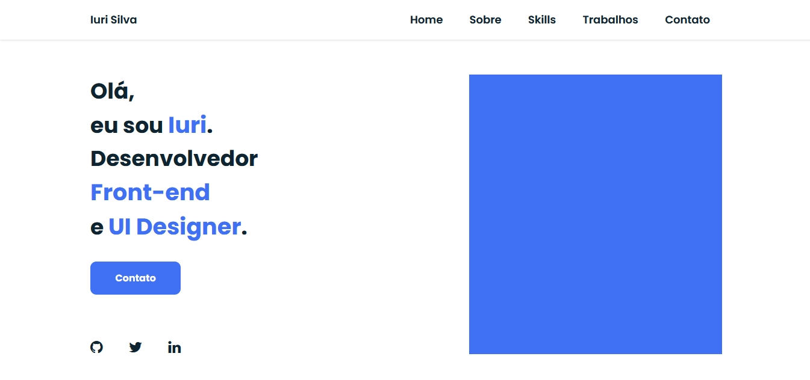

# 🦩 Portfólio feito com o pré-processador Sass 

## 📱 Resultado de como ficou 

<strong>Acesse esse link para visitar o projeto online:</strong> https://iuricode.github.io/portfolio-sass/

## 🚀 Tecnologias 
Esse projeto foi desenvolvido com as seguintes tecnologias: HTML5, SASS (e convertido para CSS3).

## 🌳 Observação 
Eu gostei de mais usar Sass, é um tecnologia para ser usado em projetos grandes pois, ela é bem melhor para modificações do que o CSS puro!  

## 💻 Projeto 
Com todas essas informações, criei um portfólio usando ele, nele usei fazias coisas como variáveis, mixins, include, extend e outras coisas que o Sass disponibiliza para a gente.

## 📝 Licença 
O uso não autorizado e/ou duplicação deste material sem permissão expressa e por escrito. 
Trechos e links podem ser usados, desde que o crédito total e claro seja dado a iuricode com orientação apropriada e específica para o conteúdo original.
