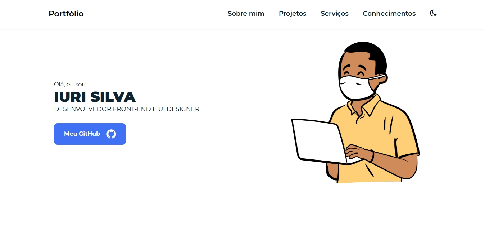
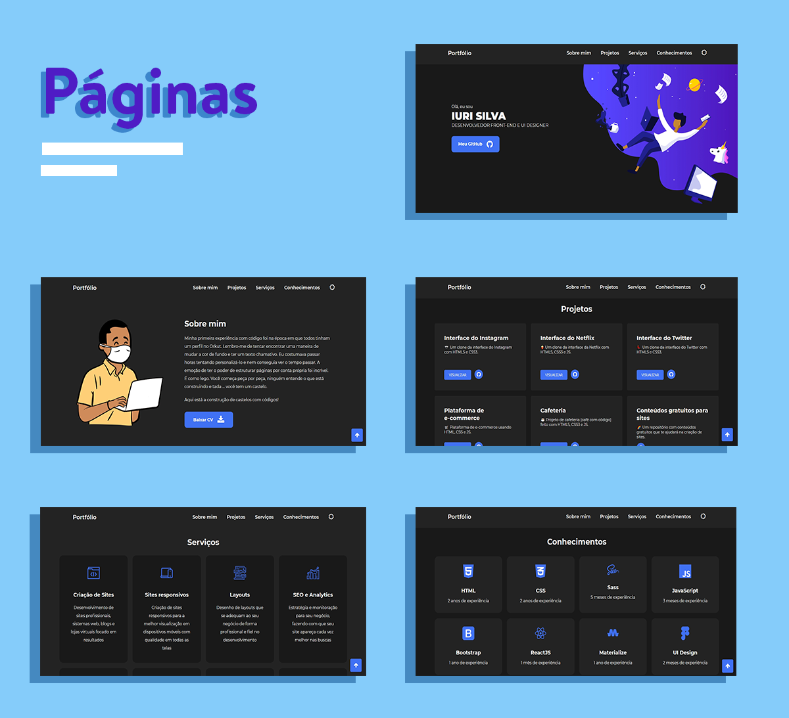

# 🍣 Meu Portfólio 

## 🖥 Visualização

## 🌳 Projeto 
O objetivo do projeto é colocar meus projetos, informações sobre mim, informar meus conhecimentos, serviços e disponibilizar meu currículo, para a visualização dos clientes/empresas.  

## 📚 Seções
O site é composto por 5 seções diferentes:

- **Seção Header:** Nele temos um avatar do meu github e um breve apresentação;
- **Seção Sobre Mim:** Nessa seção tenho um apresentação de um avatar só que andando e uma descrição dizendo sobre mim e além disso, temos botão para baixar meu currículo;
- **Seção Projetos:** Apresenta alguns projetos desenvolvidos e com link direto para os respectivos códigos no GitHub;
- **Seção Serviços:** Exibe através de cards os diferentes serviços em que possuo conhecimentos;
- **Seção Conhecimentos:** Aqui apresentamos meus conhecimentos no front-end e algumas estrelas para simbolizar meu nível de conhecimento sobre a linguagem;

## 🛠 Tecnologias utilizadas
Para o desenvolvimento deste site utilizei as seguintes tecnologias:
- Visual Studio Code;
- HTML;
- JavaScript;
- SASS (e convertido para CSS3);
- Jquery;

## 📌 Ajustes e melhorias
O site ainda está em desenvolvimento e as próximas atualizações serão voltadas nas seguintes tarefas:

(Próxima atualização: 10/10/2020)

- [x] Adicionar currículo;
- [x] Adicionar Dark Mode (tema escuro); 
- [x] Efeito flutuante;
- [ ] Animação no menu;  
- [ ] Melhoria na responsividade; 
---

## 🌈 Seja um dos contribuidores 
Quer fazer parte desse projeto? É simples! 
Faço um Fork nele colocando suas modificações e depois mande uma solicitação.

🏰 Orgulhosamente feito por <strong>Iuri Silva</strong>

