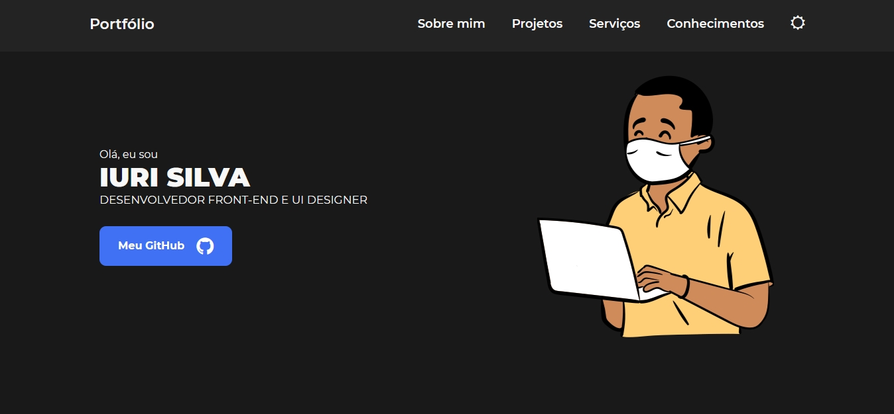
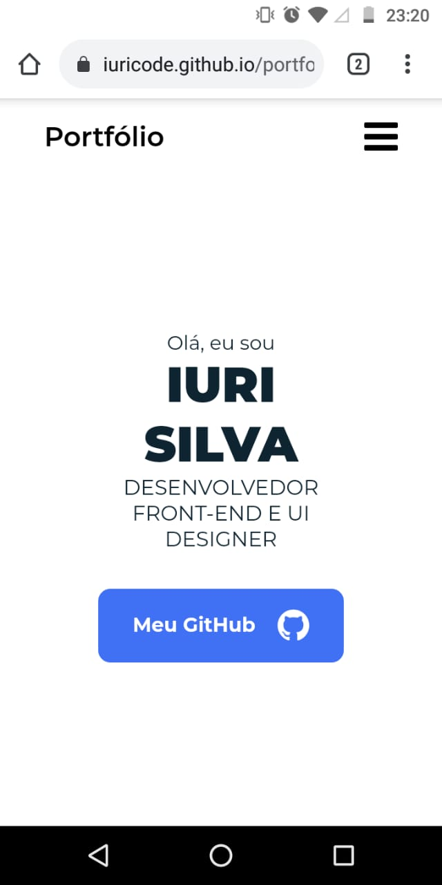
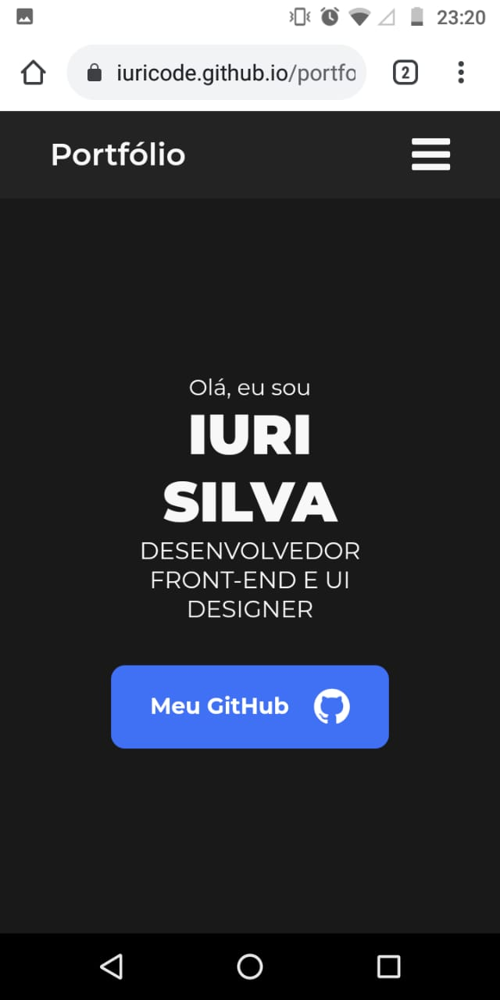

# 🍣 Meu Portfólio 

## 🖥 Visualização

## 📱 Visualização Celular

## 🌳 Observação 
Eu gostei de mais usar Sass, é um tecnologia para ser usado em projetos grandes pois, ela é bem melhor para modificações do que o CSS puro. Nele usei fazias coisas como variáveis, mixins, include, extend e outras coisas que o Sass disponibiliza para a gente.  

## 📚 Seções
O site é composto por 5 diferentes seções:

- **Seção Header:** 
- **Seção Sobre Mim:**
- **Seção Projetos:** 
- **Seção Serviços:** Exibe através de cards os diferentes serviços em que possuo conhecimentos;
- **Seção Conhecimentos:** Apresenta alguns projetos desenvolvidos e com link direto para os respectivos códigos no GitHub;

## 🛠 Tecnologias utilizadas
Para o desenvolvimento deste site utilizei as seguintes tecnologias:
- Visual Studio Code;
- HTML;
- JavaScript;
- SASS (e convertido para CSS3);
- Jquery;

## 📌 Ajustes e melhorias
O site ainda está em desenvolvimento e as próximas atualizações serão voltadas nas seguintes tarefas:

- [x] Adicionar currículo;
- [ ] Adicionar Dark Mode (tema escuro); 
- [ ] Animação em meus conhecimentos;
- [ ] Efeitos do fundo das seções;
- [ ] Animação no menu;  
---

## 🌈 Seja um dos contribuidores 
Quer fazer parte desse projeto? É simples!
Faço um Fork nele colocando suas modificações e depois mande uma solicitação.

🏰 Orgulhosamente feito por <strong>Iuri Silva</strong>

