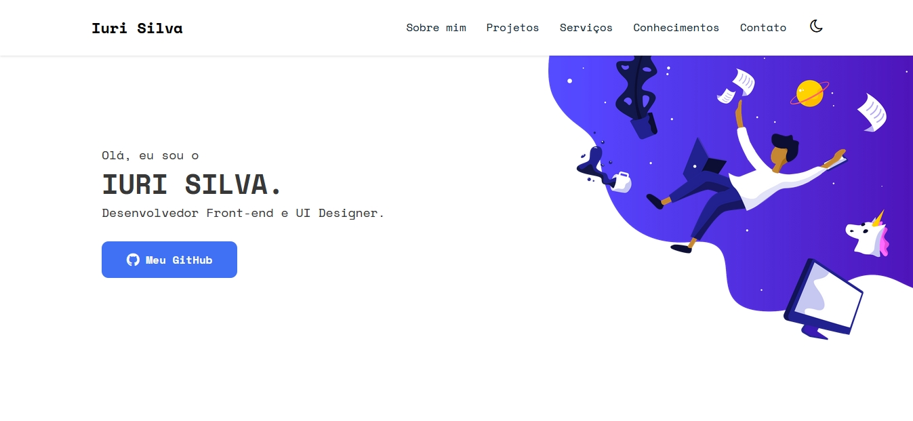

<h1 align="center">
📰 Meu Portfólio
</h1>

<h4 align="center">
Portfólio criado com o intuito de mostrar meus recentes e futuros projetos ao decorrer da minha carreira.
</h4>

## 📚 Seções
O site é composto por 6 seções diferentes:

- **Header:** Nele temos um avatar do meu github e um breve apresentação;
- **Sobre Mim:** Nessa seção tenho uma descrição dizendo um pouco sobre mim;
- **Projetos:** Apresenta alguns projetos desenvolvidos e com link direto para os respectivos códigos no GitHub;
- **Serviços:** Exibe através de cards os diferentes serviços em que possuo conhecimentos;
- **Conhecimentos:** Nele apresentamos meus conhecimentos em algumas linguagens como o foco no front-end;

---

## 💼 Tecnologias utilizadas
Para o desenvolvimento deste site utilizei as seguintes tecnologias:

- Visual Studio Code (Editor de código);
- HTML;
- JavaScript;
- SASS (Compilador em CSS);
- JQuery;

---

## 📌 Ajustes e melhorias
O site ainda está em desenvolvimento e as próximas atualizações serão voltadas nas seguintes tarefas:

- [x] Adicionar Dark Mode (tema escuro);
- [x] Colocar projetos;
- [x] Efeito flutuante;
- [x] Animação no menu;  
- [x] Responsividade;
- [x] Seção de contato;

---

## 👨‍🦯 Acessibilidade

- [x] Etapa 1
  ##### Marcação:
  - Recomendação 1.1 – Respeitar os Padrões Web;
  - Recomendação 1.2 – Organizar o código HTML de forma lógica e semântica;
  - Recomendação 1.5 – Fornecer âncoras para ir direto a um bloco de conteúdo;
  
  ##### Comportamento:
  - Recomendação 2.3 - Não criar páginas com atualização automática periódica;
  - Recomendação 2.4 – Não utilizar redirecionamento automático de páginas;
  - Recomendação 2.6 – Não incluir situações com intermitência de tela;  
  
- [x] Etapa 2
  ##### Conteúdo / Informação:
  - Recomendação 3.1 – Identificar o idioma principal da página;
  - Recomendação 3.3 – Oferecer um título descritivo e informativo à página;
  - Recomendação 3.6 – Fornecer alternativa em texto para as imagens do sítio;  
  
- [x] Etapa 3
  ##### Apresentação / Design:
  - Recomendação 4.1 - Oferecer contraste mínimo entre plano de fundo e primeiro plano;
  - Recomendação 4.2 – Não utilizar apenas cor ou outras características sensoriais para diferenciar elementos;  
  
- [x] Etapa 4
  ##### Multimídia:
  - Recomendação 5.5 – Fornecer controle de animação; 

  ##### Formulários:
  - Recomendação 6.1 – Fornecer alternativa em texto para os botões de imagem de formulários;
  - Recomendação 6.2 – Associar etiquetas aos seus campos;
  - Recomendação 6.3 – Estabelecer uma ordem lógica de navegação;
  - Recomendação 6.4 – Não provocar automaticamente alteração no contexto;
  - Recomendação 6.5 – Fornecer instruções para entrada de dados;
  - Recomendação 6.6 – Identificar e descrever erros de entrada de dados e confirmar o envio das informações;
  - Recomendação 6.7 – Agrupar campos de formulário;  
  
  
Clique **[aqui](http://emag.governoeletronico.gov.br/)** para ver as recomendações de acessibilidade na eMAG.

---

 [🔝 Voltar ao topo](#-seções) 

## 🦄 Autor 
<table>
  <tr>
    <td align="center">
      <a href="https://github.com/iuricode">
         
        
          <b>Iuri Silva</b>
        
      </a>
    </td>
  </tr>
</table>

## 🌈 Contribuidores 
<table>
  <tr>
    <td align="center">
      <a href="https://github.com/BrianIto">
         
        
          <b>Brian Ito</b>
        
      </a> 
    </td>
    <td align="center">
      <a href="https://github.com/afaferz">
         
        
          <b>Afaferz</b>
        
      </a> 
    </td>
  </tr>
</table>
